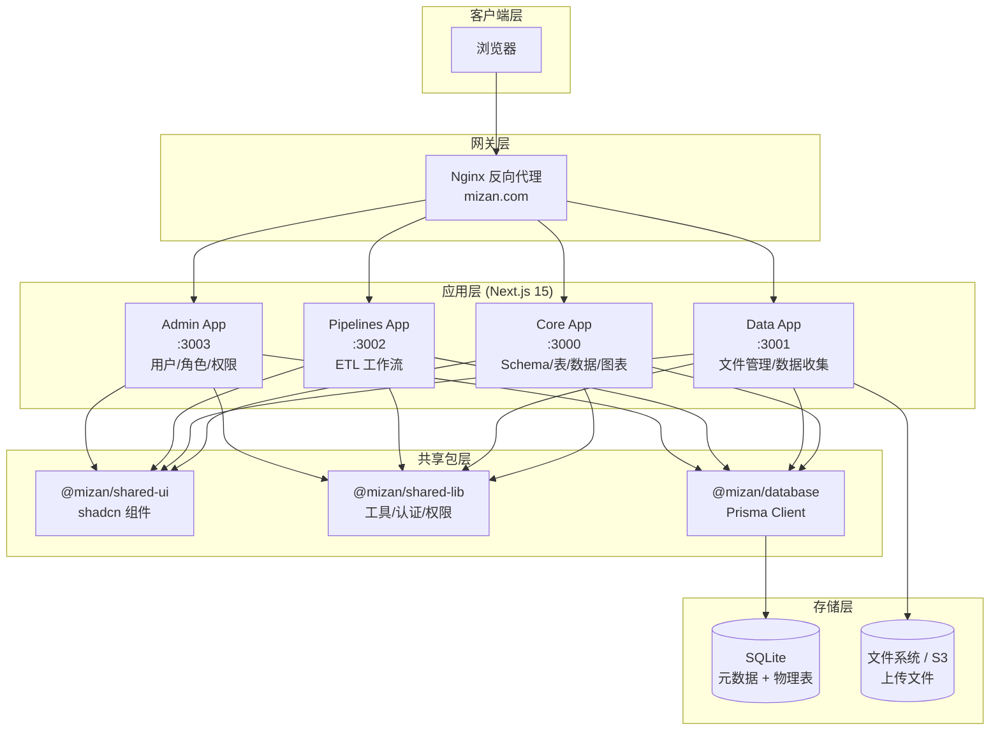
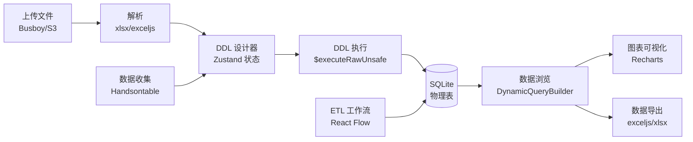
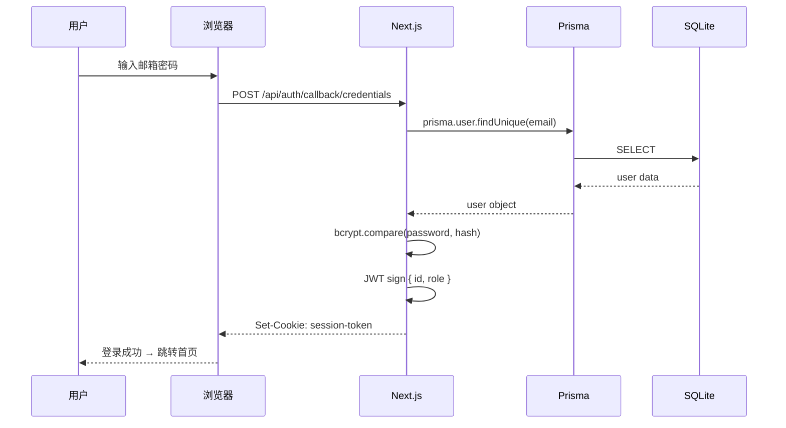
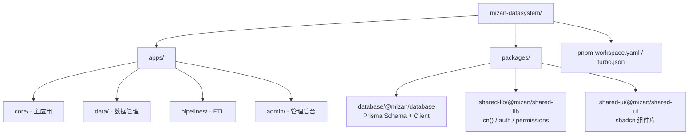
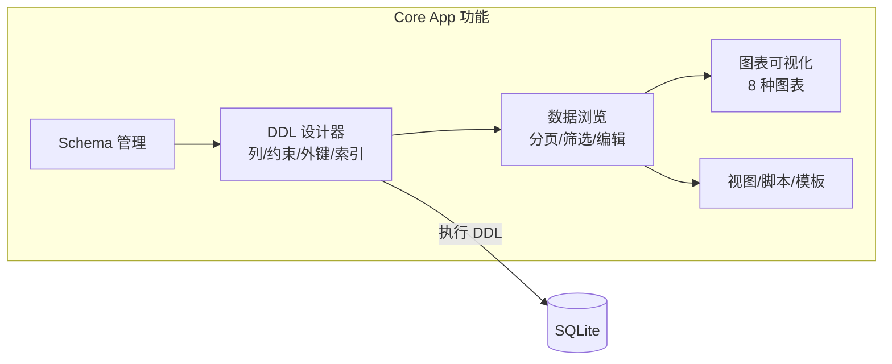
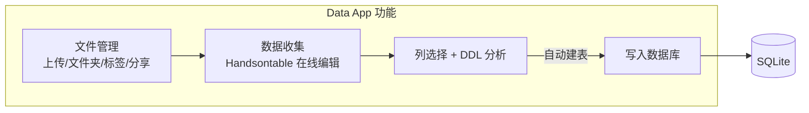
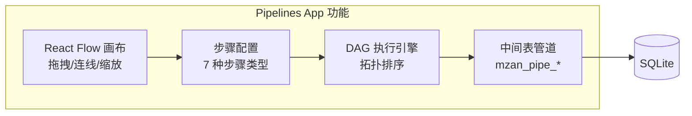
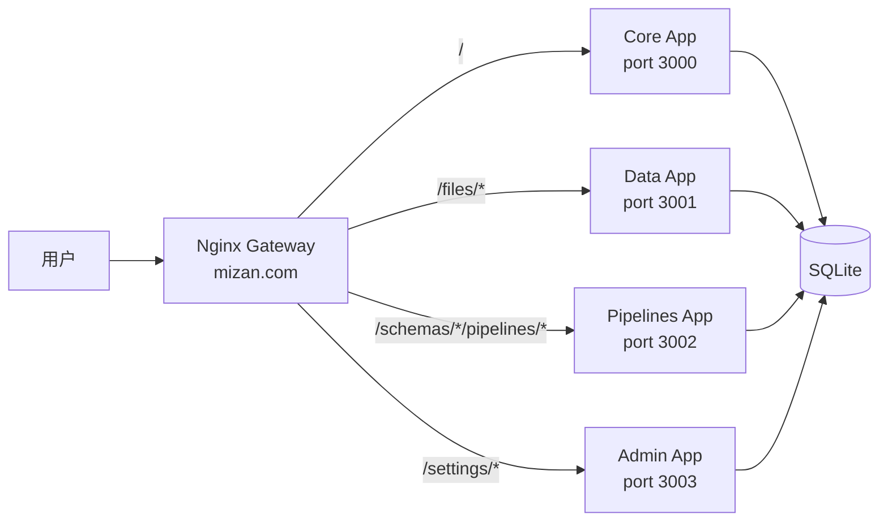

# Mizan 数据管理系统

基于 Next.js 15 的全栈可视化数据管理平台，采用 pnpm monorepo + Turborepo 架构，支持多应用独立开发与部署。

---

## 技术架构

### 技术栈

| 类别 | 技术 | 用途 |
|------|------|------|
| 框架 | Next.js 15 (App Router) | 全栈 React 框架，SSR + API 路由 |
| 数据库 | SQLite + Prisma 6 | 元数据存储与动态物理表 |
| 认证 | NextAuth.js v4 + JWT | 凭证登录与会话管理 |
| UI | shadcn/ui (Radix + Tailwind) | 组件库与样式 |
| 状态管理 | Zustand + TanStack React Query | 客户端/服务端状态分离 |
| 图表 | Recharts | 数据可视化 |
| 电子表格 | Handsontable + xlsx (SheetJS) | 在线表格编辑与解析 |
| 存储 | 本地文件系统 / S3 兼容 | 文件上传存储 |
| 工作流 | @xyflow/react (React Flow) | ETL 可视化画布 |

### 系统架构图



### 数据流



### 认证流程



### Monorepo 结构



### 关键设计

- **元数据与物理数据分离** — Prisma 仅管理表结构定义，实际数据表由用户动态创建
- **异步导入队列** — 文件上传后后台批量处理（每批 500 行），支持并发控制
- **DDL 幂等执行** — 物理表存在时 ALTER TABLE ADD COLUMN，不存在时 CREATE TABLE
- **细粒度权限** — Admin → Schema Owner → TablePermission → ColumnPermission 四级管控

---

## 应用模块

### Core App (主应用)

**功能**：仪表盘、Schema 管理、表格定义与 DDL 设计器、数据浏览与编辑、图表可视化、视图/脚本管理、导出模板、导入向导、看板

**端口**：`3000`（开发）



**技术亮点**：
- DynamicQueryBuilder 参数化 SQL 查询
- 11 种数据类型 + 约束/外键/索引/触发器
- 8 种图表类型 (Recharts)
- 物理表缺失自愈

### Data App (数据管理)

**功能**：文件管理（上传/文件夹/标签/分享/预览）、数据收集工具（Excel 在线编辑 → 列选择 → DDL 分析 → 写入）

**端口**：`3001`（开发）



**技术亮点**：
- Handsontable 在线 Excel 编辑（公式/合并/图片/快捷键）
- 嵌入图片提取 (adm-zip)
- 自动 DDL 分析 + 类型推导
- S3 兼容云存储

### Pipelines App (ETL 工作流)

**功能**：可视化 Pipeline 编辑器、步骤配置、DAG 执行引擎

**端口**：`3002`（开发）



**技术亮点**：
- @xyflow/react (React Flow) 画布
- 7 种步骤类型：数据源/SQL/合并/筛选/输出
- DAG 拓扑排序 (Kahn 算法)
- 中间表管道 (mzan_pipe_*)

### Admin App (管理后台)

**功能**：用户管理、角色管理 (RBAC)、权限总览、存储设置、数据同步

**端口**：`3003`（开发）

**技术亮点**：
- 表级 + 列级权限控制
- 超级管理员 (ADMIN 角色)
- 外部 API 同步引擎

---

## 部署方式

### 环境要求

- Node.js >= 18 + pnpm >= 9

### 本地开发

```bash
# 安装依赖
pnpm install

# 初始化数据库
pnpm db:push

# 启动主应用
pnpm dev
# → 启动 @mizan/app-core :3000

# 启动子应用 (独立端口)
pnpm --filter @mizan/app-data dev       # :3001
pnpm --filter @mizan/app-pipelines dev   # :3002
pnpm --filter @mizan/app-admin dev       # :3003
```

### Docker 部署 (单应用)

每个应用可独立构建和部署。以 Core 为例：

```bash
# 构建 Core App 镜像
docker build -f apps/core/Dockerfile -t mizan-core .

# 运行
docker run -d -p 3000:3000 \
  -v mizan-data:/app/packages/database/prisma/dev.db \
  -v mizan-uploads:/app/public/uploads \
  -e NEXTAUTH_URL="http://your-domain:3000" \
  -e NEXTAUTH_SECRET="your-secret" \
  mizan-core
```

### Docker Compose (全应用)

使用 `docker-compose.yml` 一键启动所有应用及反向代理：

```bash
docker-compose up -d
```

### 跨 Zone 路由 (Multi-Zones)

生产环境通过 Nginx 反向代理组合各应用：



```nginx
upstream core       { server 127.0.0.1:3000; }
upstream data       { server 127.0.0.1:3001; }
upstream pipelines  { server 127.0.0.1:3002; }
upstream admin      { server 127.0.0.1:3003; }

server {
  listen 80;
  client_max_body_size 50M;
  location /                     { proxy_pass http://core; }
  location /files/               { proxy_pass http://core; }
  location ~ ^/schemas/[^/]+/pipelines/  { proxy_pass http://pipelines; }
  location /settings/            { proxy_pass http://admin; }
}
```

### 环境变量

| 变量 | 说明 | 默认值 |
|------|------|--------|
| `DATABASE_URL` | SQLite 数据库路径 | `file:./dev.db` |
| `NEXTAUTH_URL` | NextAuth 回调 URL | `http://localhost:3000` |
| `NEXTAUTH_SECRET` | JWT 加密密钥 | 必填 |
| `UPLOAD_DIR` | 上传文件目录 | `./public/uploads` |
| `STORAGE_TYPE` | 存储 | `local` / `s3` |
| `IMPORT_MAX_CONCURRENCY` | 最大并发导入数 | `2` |

---

## 模块功能详情

### 数据收集与导入
- Handsontable 在线 Excel 预览（编辑/公式/合并/图片）
- 交互式列选择 → 自动 DDL 分析 → 创建表 → 写入数据
- 异步后台导入，排队 + 并发控制

### 表格设计器 (DDL Designer)
- 列管理、约束（主键/非空/唯一/自增/CHECK）
- 外键、索引、触发器
- SQL 实时预览

### 数据浏览与操作
- 分页/排序/搜索/筛选（11 种操作符）
- 内联编辑、批量操作、批量导入 (upsert)
- 数据导出 (Excel/CSV)

### ETL 工作流
- React Flow 可视化画布、拖拽节点、动态连线
- 7 种步骤类型、DAG 拓扑排序执行

### 数据可视化
- 8 种图表：柱状/折线/面积/饼图/散点/组合/雷达/热力

### 权限与安全
- 表级 + 列级权限、超级管理员、RBAC

### 其他
- 文件管理（上传/文件夹/标签/搜索/分享）
- 视图/脚本管理、导出模板
- Schema/Dashboard 管理
- 关联查询、自动 API 文档

---

## 后续计划

### 短期
- 注册验证码（邮箱/图形）
- DDL 版本管理与回滚
- 用户个人资料编辑
- 跨 Zone 完全拆分

### 中期
- AI 辅助设计（自然语言 → 表结构）
- 数据质量监控与告警
- 协作编辑

### 长期
- 多数据库支持 (MySQL/PostgreSQL)
- 插件生态
- 移动端适配
